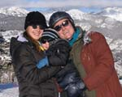
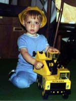

## 1-2 paragraph standard professional bio

(or look at my [C.V.](http://pages.cs.wisc.edu/~gleicher/CV.pdf))

(Circa 2019)

Michael Gleicher is a Professor in the Department of Computer Sciences at the University of Wisconsin, Madison.  Prof. Gleicher is founder of the Department's Visual Computing Group. He co-directs both the Visual Computing Laboratory and the Collaborative Robotics Laboratory at UW-Madison. His research interests span the range of visual computing, including data visualization, robotics, and virtual reality. Prior to joining the University, Prof. Gleicher was a researcher at The Autodesk Vision Technology Center and in Apple Computer's Advanced Technology Group. He earned his Ph. D. in Computer Science (1994) from Carnegie Mellon University, and holds a B.S.E. in Electrical Engineering from Duke University (1988). In 2013-2014, he was a visiting researcher at INRIA Rhone-Alpes. Prof. Gleicher is an ACM Distinguished Scientist.

(Circa 2016)

Michael Gleicher is a Professor in the Department of Computer Sciences at the University of Wisconsin, Madison. Prof. Gleicher is founder of the Department's Visual Computing Group. His research interests span the range of visual computing, including data visualization, robotics, image and video processing tools, virtual reality, and character animation. His current foci are human data interaction and human robot interaction. Prior to joining the university, Prof. Gleicher was a researcher at The Autodesk Vision Technology Center and in Apple Computer's Advanced Technology Group. He earned his Ph. D. in Computer Science from Carnegie Mellon University, and holds a B.S.E. in Electrical Engineering from Duke University. In 2013-2014, he was a visiting researcher at INRIA Rhone-Alpes. Prof. Gleicher is an ACM Distinguished Scientist.

(Old version Circa 2010)

Michael Gleicher is a Professor in the Department of Computer Sciencesat the University of Wisconsin, Madison. Prof. Gleicher is founderand leader of the Department's Computer Graphics group. His researchgenerally revolves around the question: "How can we use ourunderstanding of human perception and artistic traditions to improveour tools for communicating and data understanding." He has beenexploring this question in four areas: visualization (creating toolsto help people make sense of complex data sets); creating better toolsfor the creation of images and video; creating better characteranimation technologies for films and games; and computationalstructural biology. Prof. Gleicher is an ACM Distinguished Scientist.

Prior to joining the university, Prof. Gleicher was a researcher atThe Autodesk Vision Technology Center and at Apple Computer's AdvancedTechnology Group. He earned his Ph. D. in Computer Science fromCarnegie Mellon University, and holds a B.S.E. in ElectricalEngineering from Duke University.

(older version, approximately 2009)

Michael Gleicher is a Professor in the Department of Computer Sciencesat the University of Wisconsin, Madison. Prof. Gleicher is founder andleader of the Department's Computer Graphics group. The overall goalof his research is to create tools that make it easier to createpictures, video, animation, and virtual environments; and to makethese visual artifacts more interesting, entertaining, andinformative. He seeks to build and apply an understanding of human perception, artistic traditions, numerical computation, and geometry.His current focus is on tools for character animation,for the automated production of multimedia, and visualization andgeometric analysis for biological applications, particularlystructural bioinformatics.

Prior to joining the university, Prof. Gleicher was a researcher atThe Autodesk Vision Technology Center and at Apple Computer's AdvancedTechnology Group. He earned his Ph. D. in Computer Science fromCarnegie Mellon University, and holds a B.S.E. in ElectricalEngineering from Duke University.

## More illustrated version

<table><tr><td align="right" valign="top">

</td><td valign="top">

In 2009, I was promoted to Professor. I also finally redid this page
after 10 years, but I just copied old stuff.

</td></tr><tr><td align="right" valign="top">
}}' title=""/>
</td><td valign="top">

In 2004, I was promoted to Associate Professor (i.e. tenured). I also
married Julie Loehrl. Our son Sam was born on April 5, 2005. 

</td></tr><tr><td align="right" valign="top">
</td><td valign="top">

In August of 1998, I joined the faculty of the Computer Science
Department at the University of Wisconsin Madison as an Assistant
Professor. My mission is to start a computer graphics group. As of
last check, I am succeeding.

</td></tr><tr><td align="right" valign="top">
</td><td valign="top">

From June of 1997 to July of 1998 I was a "research scientist" in
Autodesk's now defunct Vision Technology Center. I did not work on any
Autodesk products, but I did research on video tracking, motion
capture and editing techniques.

</td></tr><tr><td align="right" valign="top">

</td><td valign="top">

From August of 1994 through March of 1997 I was a research scientist
in the graphics group of Apple Computer's research laboratories (which
was usually called the Advanced Technology Group, but they kept
changing the name). I worked on a variety of research projects
involving computer animation, computer vision, and user interfaces.

</td></tr><tr><td align="right" valign="top">

</td><td valign="top">

I was a graduate student in the Computer Science Department of
Carnegie Mellon University from August 1988 through August 1994. While
I was there, I earned a PhD and an MS. My thesis, "A Differential
Approach to Graphical Interaction" was supervised by Andy Witkin. 

</td></tr><tr><td align="right" valign="top">

</td><td valign="top">

I was an undergraduate at Duke University, and recieved a BSE in
Electrical Engineering and Computer Science. I didn't do any computer
graphics while I was there.

</td></tr><tr><td align="right" valign="top">

</td><td valign="top">

<strong>Some personal info:</strong>

I lived in Springfield, NJ until I went to college. My parents still
live there. My dad's company is on the <a class="urllink" href="http://www.gleicher.com" rel="nofollow">web</a>.

I generally like things involving mountains, music, and food. I like
to downhill ski, play guitar and bass, and cook.

(yes, the picture to the left is me)

</td></tr></table>

