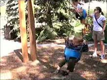
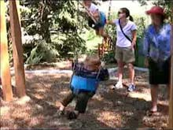

{}
Re-Cinematography was our circa 2007 video stabilization system. 
At the time, it was way better than anything else. 
It inspired later techniques, notably our
[2009 3D Warping technique](), and our 
[2010 Subspace Warping]()
technique (which evolved into the Adobe Warp Stabilizer.).

Re-Cinematography pushed the limits of what could be done with 2D global warps (using a single, 8 parameter projective warp over the entire image). The later techniques (e.g. {}) went beyond  it by allowing for warping the image, not just global deformations.

However, Re-Cinematography's key insight was to try to make good camera movements. The ideas were really good: but the implementation is a bit of a hack (it works by piecing together spline segments with heuristics). Later work by Grundmann et. al gave a nice mathematical formulation to get the same dynamics. We used this L1 optimization approach in some of our later work ([Zooming on All Actors](https://graphics.cs.wisc.edu/Papers/2017/KGRG17/) and [Multi-Clip Editing](https://graphics.cs.wisc.edu/Papers/2014/GRG14/)).

+ Matthias Grundmann, Vivek Kwatra, and Irfan Essa. 2011. Auto-directed video stabilization with robust L1 optimal camera paths. In CVPR 2011, 225–232. [DOI:10.1109/CVPR.2011.5995525](https://doi.org/10.1109/CVPR.2011.5995525).
{}

Re-Cinematography is video stabilization taken to the next level: rather than just getting rid of some of the jitter, the methods try to figure out what camera movements might have been done by a professional with good equipment, and then alter the video to look like that.

If you don't believe me, look at the video examples below! (or on [the video page]())

## 1. Abstract

This article presents an approach to postprocessing casually captured videos to improve apparent camera movement. Re-cinematography transforms each frame of a video such that the video better follows cinematic conventions. The approach breaks a video into shorter segments. Segments of the source video where there is no intentional camera movement are made to appear as if the camera is completely static. For segments with camera motions, camera paths are keyframed automatically and interpolated with matrix logarithms to give velocity-profiled movements that appear intentional and directed. Closeups are inserted to provide compositional variety in otherwise uniform segments. The approach automatically balances the tradeoff between motion smoothness and distortion to the original imagery. Results from our prototype show improvements to poor quality home videos.

## 2. Papers

The final journal paper:

- Michael Gleicher and Feng Liu. Re-Cinematography: Improving the Camerawork of Casual Video. _ACM Transactions on Multimedia Computing Communications and Applications (TOMCCAP), 5, 1, 2._ October 2008. [PDF](http://www.cs.wisc.edu/graphics/Papers/Gleicher/Video/tomccap-proof.pdf) [EE/DOI](http://doi.acm.org/10.1145/1404880.1404882)

The original conference paper (that was best-in-track winner). _Note:_ the journal paper (above) really is a big improvement. Some of the methods in the original paper are significantly improved, and there are new things added.

- Michael Gleicher and Feng Liu. Re-Cinematography: Improving the Camera Dynamics of Casual Video. _ACM Multimedia 2007, best paper nominee._ September 2007. [PDF](http://www.cs.wisc.edu/graphics/Papers/Gleicher/Video/mm07-recin.pdf) [EE/DOI](http://doi.acm.org/10.1145/1291233.1291246)

## 3. Videos

All source video was taken with a Sanyo Xacti C5 digicam (MPEG4, 640x480) with its default image stabilization on. So, all of these examples can be considered a comparison with the state of the art. Most videos include a side-by-side comparison with the source, as well as a 2X comparison.

Note that the examples are all full frame: we don't crop artifacts at the edges (like we did in some later work). The problem is that the method often has to guess what is off the frame, and these artifacts come from guessing badly.

There is a "video paper" that is almost 9 minutes long that was used to explain what was in the paper (it was targeted towards reviewers). It includes the examples below (but not in the order on the web page).

Unfortunately, the short clips only exist in an old video format. Please see the [the video page]()

### 3.1 Examples

see the video 

### 3.2 Illustrative Examples (animated diagrams from paper)

see the video

### 3.3 Extra Examples

(lost to history ...)

### 3.4 Artifacts

If you look at the video, you will undoubtedly notice artifacts. The biggest ones come from the fact that when we move the camera viewpoint, a portion of the frame becomes uncovered. In re-cinematography, we choose to "fill in" these portions of the frame from previous frames - in the future or the past. Here's a dramatic example from the "swing" video above:

<table><tr>
    <td align="center" valign="top" width="250">
        

             
              
            source frame
        

    </td>
    <td align="center" valign="top" width="250">
        

            
              
            result frame
        

    </td>
</tr></table>

Notice that the woman in the red hat doesn't appear in the source image - we had to pull here from another part of the video! 

Our system uses a simple method for fill in, however, the system will look up to 3 seconds in the past or future to find things to use for fill in. The alternative would be to crop the frame - and make the resulting video tiny. This is what we did in the later 3D stabilization work. Its a tradeoff.

## 4. Follow on work

In follow on work, we are developing better methods to fix camera motions. Our first is a "3D Warping" method ([Siggraph 2009 paper](http://pages.cs.wisc.edu/~fliu/project/3dstab.htm)). It provides better results, when it works. Re-Cinematography gets decent/good results on hard examples, while 3D warping gets great results on not-so-hard examples. For some technical (and some pragmatic) reasons, we really haven't been able to run both methods on the same examples.

